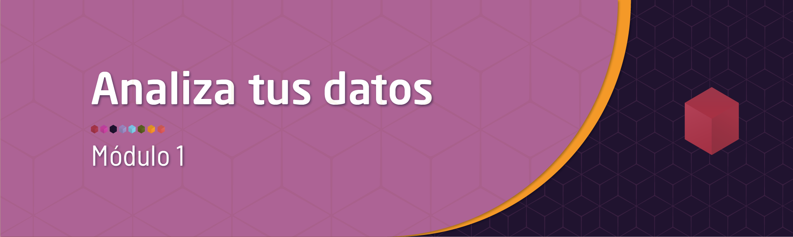
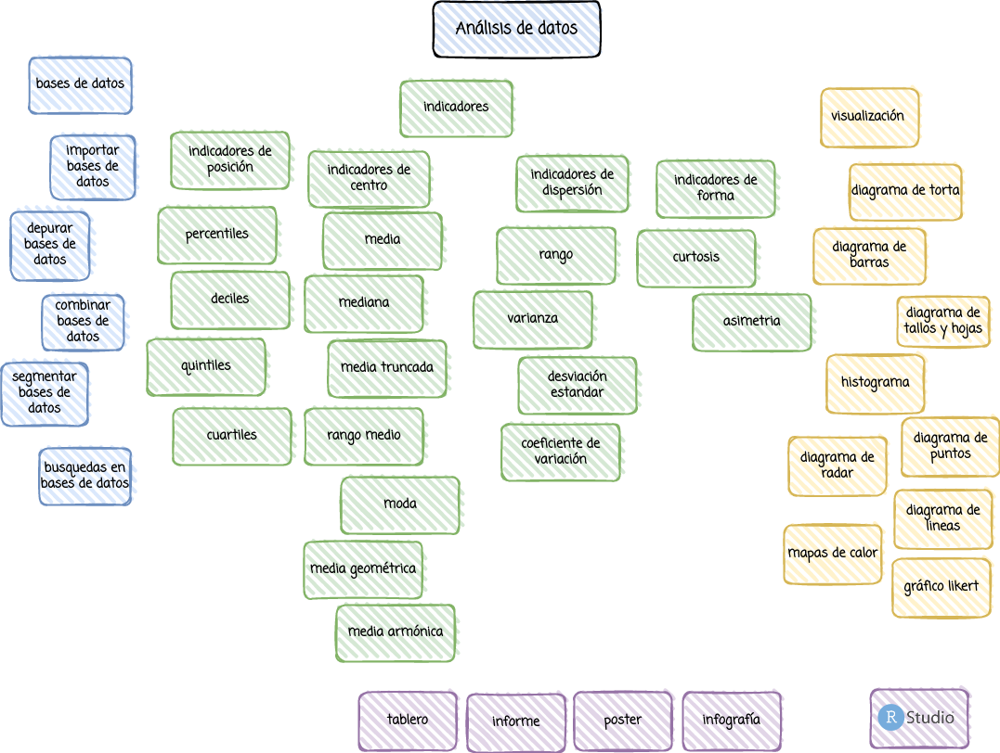

```{r setup, include=FALSE}
knitr::opts_chunk$set(echo = TRUE)

# colores
c0= "#b0394a"
c1= "#ad6395"
c2= "#a391c4"
c3= "#8acfe6"
c4= "#646420"
c5= "#db524f"
```



<br/><br/>

# **Introducción**

Este primer módulo te permitirá recorrer los  pasos de la metodología estadística  y realizar un análisis descriptivos de tus datos, empleando para ellos software estadístico y diversas bases de datos disponibles en internet.  Para lograrlo se plantean tres unidades : Bases de datos, Tablas de frecuencia e indicadores descriptivos y por último la representación  gráfica o visualización de  datos.  Requiere revisar los conceptos de sumatoria  y productoria contenidos en  el Modulo 0

<br/><br/><br/>

# **Objetivo**

Al finalizar este módulo el estudiante estará en capacidad de RESUMIR e INTERPRETAR información mediante la construcción de TABLAS DE FRECUENCIA, INDICADORES DESCRIPTIVOS Y GRAFICOS para la interpretación  y construcción de informes estadísticos descriptivos 

<br/><br/><br/>

# **Mapa**


