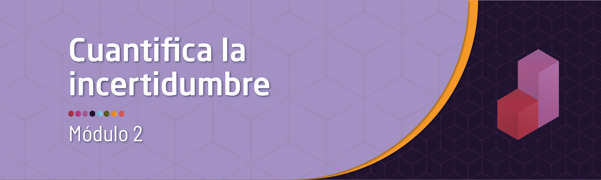
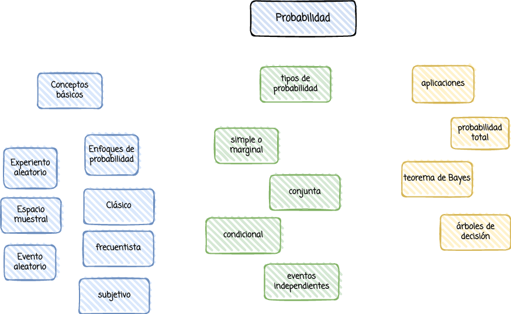

```{r setup, include=FALSE}
knitr::opts_chunk$set(echo = TRUE)

# colores
c0= "#b0394a"
c1= "#ad6395"
c2= "#a391c4"
c3= "#8acfe6"
c4= "#646420"
c5= "#db524f"
```

<br/>




<br/><br/>

# **Introducción**

El concepto de probabilidad constituye uno de los  pilares de la estadística que permiten la construcción de  conceptos posteriores como el de  variable aleatoria e inferencia estadística. Se parte de  los  conceptos básicos para lo cual se requiere revisar los temas de teoría de  conjuntos y técnicas de conteo del módulo 0.

<br/><br/><br/>

# **Objetivo**

Al finalizar el módulo el estudiante estará en capacidad de DESARROLLAR el pensamiento probabilístico mediante el cálculo e interpretación de probabilidades mediante la  comprensión de los CONCEPTOS BASICOS, los diferentes ENFOQUES y TIPOS de probabilidad  que le ayuden en la valoración del riesgo para la toma de decisiones.


<br/><br/><br/>

# **Mapa**


