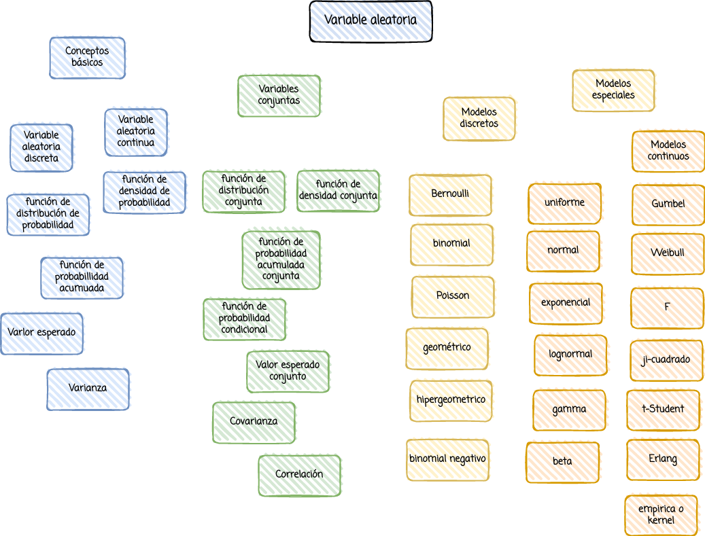

```{r setup, include=FALSE}
knitr::opts_chunk$set(echo = TRUE)

# colores
c0= "#b0394a"
c1= "#ad6395"
c2= "#a391c4"
c3= "#8acfe6"
c4= "#646420"
c5= "#db524f"
```


<br/><br/>

# **Introducción**

El concepto de variable  aleatoria  y sus principales características como el  valor esperado, la varianza, funciones de  distribución de  probabilidad y distribución  acumulada, distribuciones conjuntas, covarianza y correlación, permiten la identificación de diferentes modelos para su  uso a través de la simulación de situaciones reales. 

<br/><br/><br/>

# **Objetivo**

Al finalizar el módulo el estudiante estará en capacidad de APLICAR los conceptos y las principales características  de las VARIABLE ALEATORIA UNIVARIADAS y CONJUNTAS para RESOLVER problemas mediante la simulación a través de software estadístico.

<br/><br/><br/>

# **Mapa**


