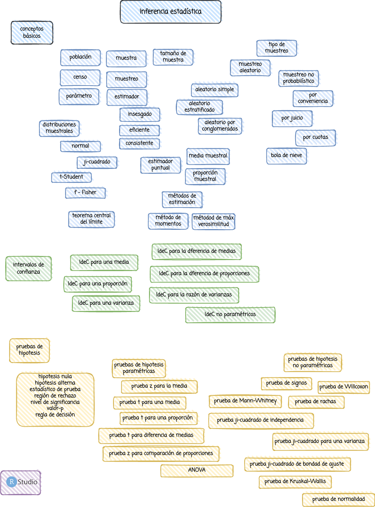

```{r setup, include=FALSE}
knitr::opts_chunk$set(echo = TRUE)

# colores
c0= "#b0394a"
c1= "#ad6395"
c2= "#a391c4"
c3= "#8acfe6"
c4= "#646420"
c5= "#db524f"
```


<br/><br/>

# **Introducción**

La inferencia estadística es una de las herramientas mas fuertes de la estadística que  permite la generalización de los resultados  obtenidos  en una muestra a  toda  la población. En este módulo encontraras los procedimientos que te permitirán realizar una correcta inferencia de tus datos.

<br/><br/><br/>

# **Objetivo**

Al finalizar el módulo el estudiante estará en capacidad de RECONOCER, INFERIR y CONSTRASTAR a partir de la estimación a través de INTERVALOS DE CONFIANZA  y PRUEBAS DE HIPOTESIS, permitiendo incorporar estas herramientas estadísticas a la toma de decisiones.


<br/><br/><br/>

# **Mapa**



