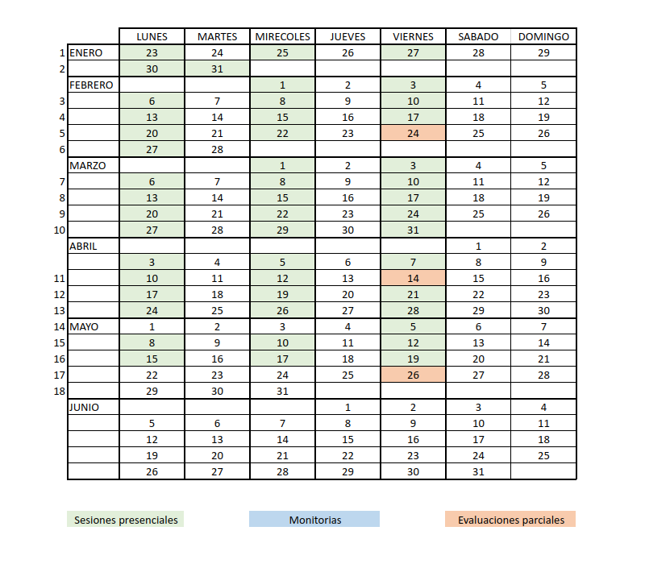

```{r setup, include=FALSE}
knitr::opts_chunk$set(echo = TRUE)
cg="#6c4675"

```

# **300MAE013**

<br/><br/>


<br/><br/><br/>


 
# **Calendario 2023-1**</span>


<br/><br/><br/>

# **Salones de clase**

|                            |                                      |
|---------------------------:|:-------------------------------------|
|  LUNES                     | SM. 1.7                              |
|  MIERCOLES                 |  LG. 1.5                             |
|  VIERNES                   |  SM. 1.7                             |

<br/><br/><br/>

# **Atención a Estudiantes**

POR DEFINIR

# **Información supletorios**

POR DEFINIR
